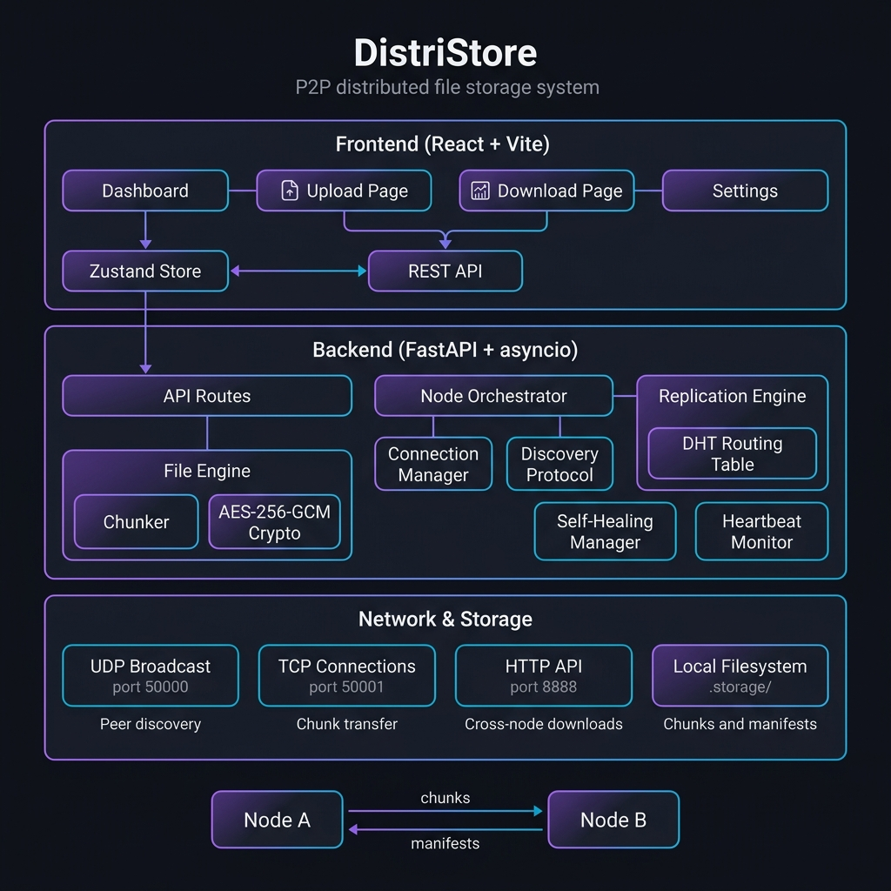
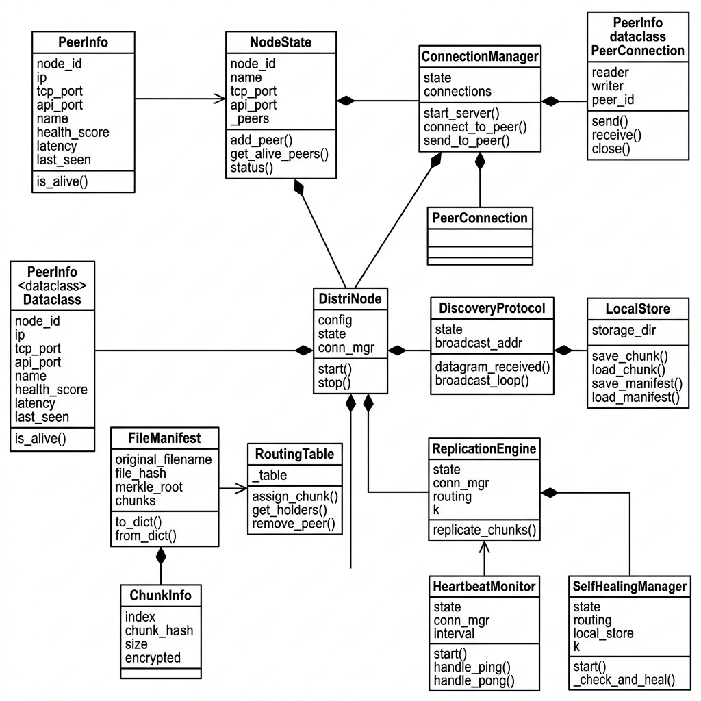
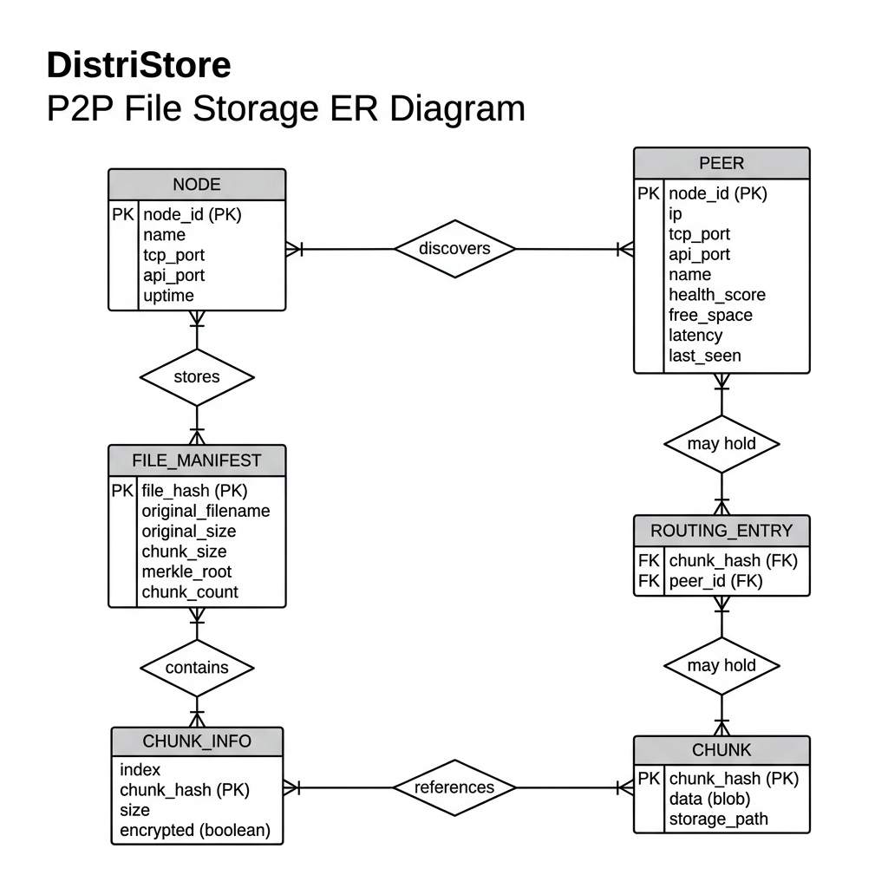
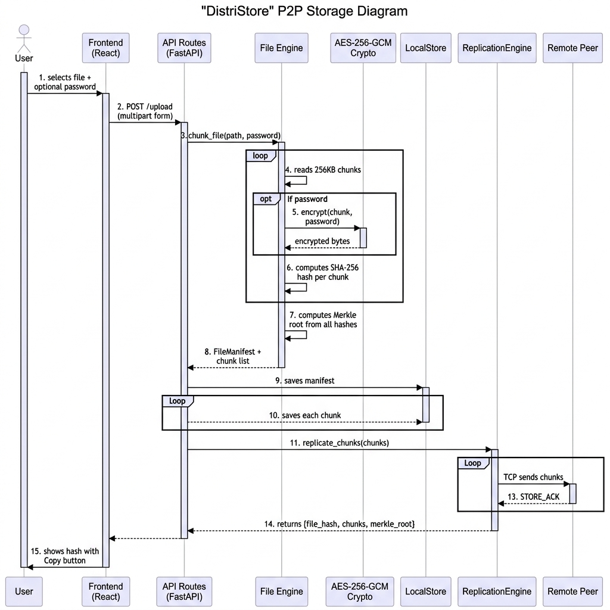
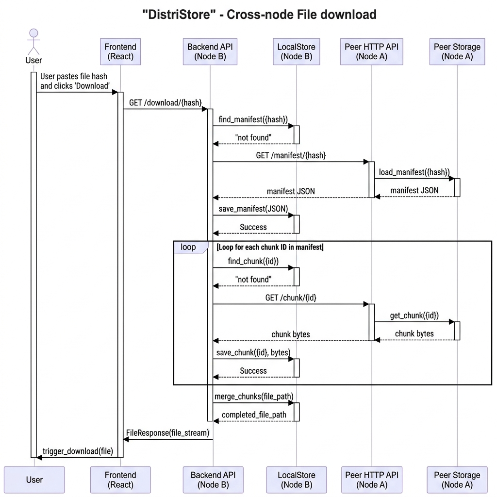
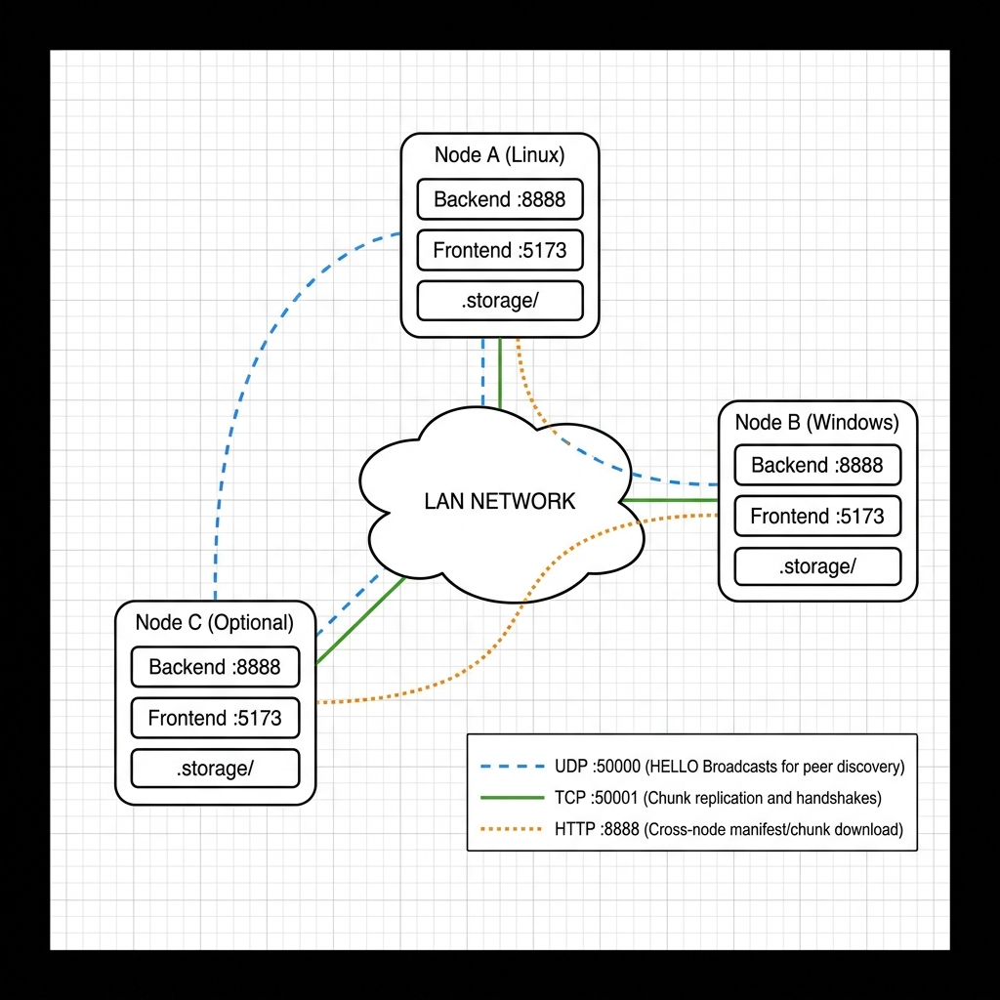

# DistriStore — Architecture & Design Document

> **Version:** 2.0 · **Last Updated:** May 2026 · **Authors:** Project Team

---

## Table of Contents

1. [System Architecture Overview](#1-system-architecture-overview)
2. [Class Diagram — Backend OOP Structure](#2-class-diagram--backend-oop-structure)
3. [Entity-Relationship Diagram — Data Model](#3-entity-relationship-diagram--data-model)
4. [Sequence Diagram — File Upload Flow](#4-sequence-diagram--file-upload-flow)
5. [Sequence Diagram — Cross-Node Download Flow](#5-sequence-diagram--cross-node-download-flow)
6. [Network Deployment Architecture](#6-network-deployment-architecture)
7. [Network Protocol & Message Types](#7-network-protocol--message-types)
8. [Peer Lifecycle — State Transitions](#8-peer-lifecycle--state-transitions)
9. [Data Flow — Chunk Pipeline](#9-data-flow--chunk-pipeline)
10. [Design Decisions & Trade-offs](#10-design-decisions--trade-offs)

---

## 1. System Architecture Overview

DistriStore is a **LAN-optimized, trackerless P2P distributed file storage system**. It combines content-addressed storage, authenticated encryption, Kademlia-style DHT routing, and cross-node HTTP-based swarmed downloads into a single cohesive platform.



### Core Design Principles

| Principle | Implementation |
|-----------|---------------|
| **Content Addressing** | Files identified by SHA-256 hash, chunks by individual hashes |
| **Zero Trust** | AES-256-GCM authenticated encryption + HMAC-SHA256 swarm PSK |
| **Decentralization** | No tracker — UDP broadcast discovery + TCP mesh for data |
| **Fault Tolerance** | k-copy replication + self-healing + SQLite crash recovery |
| **Cross-Platform** | Windows + Linux — platform-independent APIs throughout |

### Three-Layer Architecture

```
┌──────────────────────────────────────────────────────────┐
│                  PRESENTATION LAYER                      │
│          React 19 + Vite 8 + Zustand + Recharts          │
│     Dashboard │ Upload │ Download │ Settings Pages        │
├──────────────────────────────────────────────────────────┤
│                   APPLICATION LAYER                      │
│               FastAPI + asyncio + uvicorn                 │
│  API Routes │ File Engine │ DHT │ Replication │ Healing   │
├──────────────────────────────────────────────────────────┤
│               NETWORK & STORAGE LAYER                    │
│    UDP:50000 (Discovery+HMAC) │ TCP:50001 (msgpack P2P)    │
│    HTTP:8888 (Cross-Node API) │ SQLite (Persistence)       │
└──────────────────────────────────────────────────────────┘
```

### Module Dependency Map

| Module | Depends On | Purpose |
|--------|-----------|---------|
| `DistriNode` | NodeState, ConnectionManager, DiscoveryProtocol | Top-level orchestrator |
| `API Routes` | LocalStore, FileEngine, DistriNode | REST endpoints |
| `FileEngine` | Chunker, Crypto | Chunk + encrypt files |
| `ReplicationEngine` | RoutingTable, Selector, ConnectionManager | Distribute chunks to peers |
| `SelfHealingManager` | RoutingTable, LocalStore | Auto re-replicate on node failure |
| `HeartbeatMonitor` | ConnectionManager | Ping/pong peer liveness |
| `Zustand Store` | Axios API Client | Frontend global state |

---

## 2. Class Diagram — Backend OOP Structure

The backend follows an **object-oriented architecture** with clear separation of concerns. Each class has a single responsibility:



### Class Responsibilities

| Class | Layer | Responsibility |
|-------|-------|---------------|
| **DistriNode** | Orchestration | Boots TCP server, UDP discovery, peer connector loop |
| **NodeState** | State | Thread-safe peer registry with asyncio locks |
| **PeerInfo** | Data | Dataclass holding peer metadata (IP, port, health, latency) |
| **ConnectionManager** | Network | Manages TCP connections, handshakes, AUTH verification |
| **PeerConnection** | Network | Single TCP stream wrapper (msgpack framing over asyncio streams) |
| **DiscoveryProtocol** | Network | UDP datagram protocol for HMAC-signed HELLO broadcasts |
| **LocalStore** | Storage | Disk I/O for chunks + SQLite-backed manifest persistence |
| **NodeDatabase** | Storage | SQLite wrapper with `peers` and `manifests` tables (WAL mode) |
| **FileManifest** | Data | File metadata: hash, filename, chunks list, Merkle root |
| **ChunkInfo** | Data | Per-chunk metadata: index, hash, size, encrypted flag |
| **RoutingTable** | DHT | Maps `chunk_hash → [peer_ids]` for chunk location tracking |
| **ReplicationEngine** | Strategy | Selects k-best peers (XOR + heuristic) and sends chunks via TCP |
| **HeartbeatMonitor** | Advanced | Periodic PING/PONG to measure latency and detect dead peers |
| **SelfHealingManager** | Advanced | Detects under-replicated chunks and re-replicates automatically |
| **GarbageCollector** | Advanced | LRU eviction when storage exceeds quota |

### Key Relationships

- `DistriNode` **composes** `NodeState`, `ConnectionManager`, `DiscoveryProtocol`
- `NodeState` **aggregates** many `PeerInfo` instances
- `ConnectionManager` **manages** many `PeerConnection` instances
- `FileManifest` **contains** ordered list of `ChunkInfo`
- `ReplicationEngine` **uses** `RoutingTable`, `ConnectionManager`, `LocalStore`
- `SelfHealingManager` **monitors** `RoutingTable` and triggers re-replication

---

## 3. Entity-Relationship Diagram — Data Model

DistriStore uses a **hybrid storage model**: binary chunk files on the local filesystem and structured metadata in a **SQLite database** (`distristore.db`).



### Entity Descriptions

| Entity | Storage Format | Primary Key | Description |
|--------|---------------|-------------|-------------|
| **NODE** | In-memory (`NodeState`) | `node_id` (SHA-1 hex) | Current node's identity and configuration |
| **PEER** | SQLite `peers` table + In-memory (`PeerInfo`) | `node_id` | Discovered remote peers with health metrics |
| **FILE_MANIFEST** | SQLite `manifests` table | `file_hash` (SHA-256) | File metadata + chunk list + Merkle root |
| **CHUNK_INFO** | Embedded in manifest `chunks_json` | `chunk_hash` | Per-chunk metadata (index, size, encrypted) |
| **CHUNK** | Binary file (`chunk_{hash}.bin`) | `chunk_hash` (SHA-256) | Raw or encrypted chunk data |
| **ROUTING_ENTRY** | In-memory (`RoutingTable`) | `(chunk_hash, peer_id)` | Which peers hold which chunks |

### Cardinality

| Relationship | Cardinality | Description |
|-------------|-------------|-------------|
| NODE → PEER | 1 : N | A node discovers many peers via UDP/TCP |
| NODE → FILE_MANIFEST | 1 : N | A node stores many file manifests |
| FILE_MANIFEST → CHUNK_INFO | 1 : N | A manifest has many chunk entries |
| CHUNK_INFO → CHUNK | 1 : 1 | Each chunk info references one data blob |
| PEER → CHUNK | M : N | Peers may hold many chunks (via routing table) |

### Storage Layout on Disk

```
.storage/
├── distristore.db                     # SQLite database (manifests + peers)
├── chunk_2f8c6dd44b84.bin             # Raw/encrypted chunk (binary)
├── chunk_38ea85ab2dea.bin
├── chunk_786a3c6dff58.bin
├── ...                                # ~256KB-4MB per chunk (dynamic)
└── temp_357ae4e8610a.bin              # Temp file during download (auto-deleted)
```

---

## 4. Sequence Diagram — File Upload Flow

This diagram shows the complete upload pipeline: from user selecting a file to chunks being replicated across peers.



### Upload Pipeline Steps

| Step | Component | Operation | Memory |
|------|-----------|-----------|--------|
| 1 | Frontend | User selects file + optional password | — |
| 2 | API Routes | `POST /upload` receives multipart form | File on disk |
| 3 | File Engine | `_streaming_file_hash()` — SHA-256 of whole file | O(1) — 64KB blocks |
| 4 | Chunker | `_stream_chunks()` — generator yields 256KB chunks | O(1) — 1 chunk in memory |
| 5 | Crypto | `encrypt_with_key()` — AES-256-GCM per chunk | O(1) — 1 chunk |
| 6 | Chunker | `sha256_hash()` per chunk + `compute_merkle_root()` | O(N) — hash list |
| 7 | LocalStore | `save_manifest()` + `save_chunk()` × N | Disk I/O |
| 8 | Replication | `replicate_chunks()` → TCP `STORE_CHUNK` to k peers | Network I/O |

### Encryption Binary Format (Per Chunk)

```
┌─────────┬──────────┬───────────┬──────────┬─────────────┐
│ Version │   Salt   │   Nonce   │   Tag    │ Ciphertext  │
│  1 byte │ 16 bytes │  12 bytes │ 16 bytes │  N bytes    │
│  (0x01) │ (random) │  (random) │  (GCM)   │  (AES-256)  │
└─────────┴──────────┴───────────┴──────────┴─────────────┘
         HEADER (45 bytes)                PAYLOAD
```

---

## 5. Sequence Diagram — Cross-Node Download Flow

This is the **core distributed feature**: downloading a file from a peer when it's not stored locally. Upload on Node A, download on Node B using just the file hash.



### Download Pipeline Steps

| Step | Component | Operation | Fallback |
|------|-----------|-----------|----------|
| 1 | Frontend | User pastes file hash → `GET /download/{hash}` | — |
| 2 | LocalStore | `load_manifest(hash)` | → Step 3 if null |
| 3 | Peer HTTP | `GET /manifest/{hash}` on each alive peer | Try next peer |
| 4 | LocalStore | `save_manifest()` — cache for future requests | — |
| 5 | LocalStore | `load_chunk(chunk_hash)` per chunk | → Step 6 if null |
| 6 | Peer HTTP | `GET /chunk/{chunk_hash}` from peer | Try next peer |
| 7 | LocalStore | `save_chunk()` — cache locally | — |
| 8 | Chunker | `merge_chunks_to_disk()` + decrypt + integrity check | — |
| 9 | API | `FileResponse` streams temp file to frontend | — |

### Error Handling

| Condition | HTTP Status | User Message |
|-----------|-------------|-------------|
| Manifest not found anywhere | 404 | "File not found on this node or any peer" |
| Chunks missing on all peers | 404 | "Chunk {hash} not found on any node" |
| Encrypted file, no password | 400 | "This file is encrypted. Please provide the decryption password." |
| Wrong password | 400 | "File integrity check failed! (Wrong password?)" |

---

## 6. Network Deployment Architecture

DistriStore nodes communicate over **three network channels**: UDP for discovery, TCP for chunk replication, and HTTP for cross-node API calls.



### Port Allocation

| Port | Protocol | Purpose | Sharing |
|------|----------|---------|---------|
| **50000** | UDP | Peer discovery HELLO broadcasts | `SO_REUSEADDR` — multiple nodes share |
| **50001** | TCP | P2P chunk replication + handshakes | One per node (dynamic fallback) |
| **8888** | HTTP | REST API + cross-node manifest/chunk fetch | Auto-fallback 8888→8898 |
| **5173** | HTTP | Vite dev server (frontend) | One per node |

### Dual Discovery System

| Method | Primary/Fallback | When Used | Works Through Firewall? |
|--------|-----------------|-----------|------------------------|
| **UDP HELLO** | Primary | Broadcast every 5s, includes health metrics | ❌ Often blocked on Windows |
| **TCP Handshake** | Fallback | On first TCP connection, registers peer | ✅ Always works |

---

## 7. Network Protocol & Message Types

### UDP Protocol (Port 50000)

| Message | Direction | Fields | Purpose |
|---------|-----------|--------|---------|
| `HELLO` | Broadcast | `node_id, name, tcp_port, api_port, uptime, health{cpu, ram, disk, health_score}` | Peer discovery + health metrics |

### TCP Protocol (Port 50001)

| Message | Direction | Fields | Purpose |
|---------|-----------|--------|---------|
| `HANDSHAKE` | Initiator → Receiver | `node_id, name, tcp_port, api_port` | Establish connection + register peer |
| `HANDSHAKE_ACK` | Receiver → Initiator | `node_id, name, tcp_port, api_port` | Confirm connection + register peer |
| `AUTH` | Initiator → Receiver | `node_id, signature (HMAC-SHA256)` | Swarm authentication (must be first message) |
| `STORE_CHUNK` | Sender → Holder | `chunk_hash, chunk_data (raw bytes), file_hash` | Replicate chunk to peer |
| `STORE_ACK` | Holder → Sender | `chunk_hash, success` | Confirm chunk stored |
| `GET_CHUNK` | Requester → Holder | `chunk_hash` | Request chunk data |
| `CHUNK_DATA` | Holder → Requester | `chunk_hash, chunk_data (raw bytes)` | Return chunk data |
| `CHUNK_ACK` | Holder → Sender | `chunk_hash, index` | Sliding window acknowledgment |
| `FIND_NODE` | Any → Any | `target_hash` | DHT lookup |
| `FIND_RESULT` | Any → Any | `target_hash, closest_peers[]` | DHT lookup response |
| `PING` | Monitor → Peer | `sender_id` | Liveness check |
| `PONG` | Peer → Monitor | `uptime, free_space` | Liveness response |

### HTTP API (Port 8888)

| Method | Endpoint | Used By | Purpose |
|--------|----------|---------|---------|
| `GET` | `/status` | Frontend polling (3s) | Node status, peers, storage stats |
| `POST` | `/upload` | Frontend upload form | Chunk + encrypt + store + replicate |
| `GET` | `/download/{hash}` | Frontend / Cross-node | Download with peer fallback |
| `GET` | `/files?local_only=` | Frontend / Cross-node | File listing (local + peer merge) |
| `GET` | `/manifest/{hash}` | Cross-node download | Fetch manifest JSON from peer |
| `GET` | `/chunk/{hash}` | Cross-node download | Fetch raw chunk bytes from peer |

---

## 8. Peer Lifecycle — State Transitions

```
                     ┌──────────────┐
                     │  DISCOVERED  │ ◄── HELLO received (UDP)
                     │              │ ◄── HANDSHAKE received (TCP)
                     └──────┬───────┘
                            │
                            ▼
            ┌──────────────────────────────┐
            │           ALIVE              │ ◄─── HELLO / PONG updates
            │                              │      last_seen timestamp
            │  health_score, latency,      │
            │  free_space updated           │
            └──────┬──────────────┬────────┘
                   │              │
         TCP OK    │              │ No HELLO for > timeout
                   ▼              ▼
        ┌────────────────┐   ┌──────────┐
        │   CONNECTED    │   │  STALE   │
        │                │   │          │
        │ Exchanging     │   │ May      │
        │ chunks via TCP │   │ recover  │
        └───────┬────────┘   └─────┬────┘
                │                  │
        TCP     │         Exceeds  │
        disconnect         timeout │
                │                  │
                ▼                  ▼
            ┌──────────────────────────┐
            │          DEAD            │
            │                          │
            │  remove_peer()           │
            │  SelfHealingManager      │
            │  re-replicates chunks    │
            └──────────────────────────┘
```

### Peer Timeout Configuration

| Parameter | Default | Config Key |
|-----------|---------|-----------|
| HELLO broadcast interval | 5 seconds | `network.discovery_interval` |
| Peer timeout (considered dead) | 15 seconds | `network.peer_timeout` |
| Heartbeat ping interval | 5 seconds | `HeartbeatMonitor.interval` |
| Self-healing check interval | 10 seconds | `SelfHealingManager.check_interval` |

---

## 9. Data Flow — Chunk Pipeline

### Upload Data Flow

```
Original File (e.g. 10MB)
       │
       ▼
┌─────────────────┐     ┌──────────────────┐
│ Streaming Reader │     │ SHA-256 File Hash │
│ 256KB per chunk  │     │ (streaming O(1))  │
└────────┬────────┘     └────────┬─────────┘
         │                       │
         ▼                       │
   ┌───────────┐                 │
   │ Password? │                 │
   └─────┬─────┘                 │
    Yes  │   No                  │
         ▼                       │
   ┌──────────────┐              │
   │ PBKDF2 Key   │              │
   │ Derivation   │              │
   │ (100K iters) │              │
   └──────┬───────┘              │
          ▼                      │
   ┌──────────────┐              │
   │ AES-256-GCM  │              │
   │ Encrypt+Tag  │              │
   └──────┬───────┘              │
          │                      │
          ▼                      ▼
   ┌──────────────┐     ┌──────────────────┐
   │ SHA-256 Hash │     │ Merkle Tree Root │
   │ (per chunk)  │────▶│ (all chunk hashes)│
   └──────┬───────┘     └────────┬─────────┘
          │                      │
          ▼                      ▼
   ┌──────────────┐     ┌──────────────────┐
   │ chunk_{hash} │     │ manifest_{hash}  │
   │ .bin file    │     │ .json file       │
   └──────┬───────┘     └──────────────────┘
          │
          ▼
   ┌──────────────────────────┐
   │ ReplicationEngine        │
   │ XOR distance + heuristic │
   │ → TCP STORE_CHUNK × k    │
   └──────────────────────────┘
```

### Peer Scoring Formula

```
heuristic_score = normalize(free_space) + normalize(uptime) - normalize(latency)

final_targets = merge(XOR_closest_k, heuristic_top_k)  [deduplicated, capped at k]
```

---

## 10. Design Decisions & Trade-offs

### 10.1 Why Content-Addressed Storage?

Files are identified by their SHA-256 hash rather than filenames:
- **Deduplication** — identical files produce the same hash, stored once
- **Integrity** — any bit flip changes the hash, instantly detectable
- **Location independence** — any node with the hash can serve the content

### 10.2 Why Dual Discovery (UDP + TCP)?

| Method | Pros | Cons |
|--------|------|------|
| UDP HELLO | Fast broadcast, zero-config, includes health metrics | Blocked by Windows Firewall |
| TCP Handshake | Reliable, works through firewalls, bidirectional | Requires known peer IP |

**Decision:** Use both. UDP is primary for zero-config discovery. TCP handshake is the fallback — when a peer connects via TCP, it is registered even if UDP is blocked.

### 10.3 Why HTTP for Cross-Node Downloads?

Instead of a custom binary protocol for cross-node chunk fetching, we reuse the existing HTTP REST API (`/manifest/{hash}`, `/chunk/{hash}`):
- **Zero additional code** on the serving node
- **Debuggable** — standard HTTP, visible in browser dev tools
- **Cacheable** — fetched chunks saved locally for future requests
- **Firewall-friendly** — HTTP passes through most configurations

### 10.4 O(1) Memory Architecture

| Operation | Memory Strategy |
|-----------|----------------|
| Chunking | Generator reads 256KB at a time from disk |
| Encryption | Single key derived via PBKDF2, reused for all chunks |
| Download | Chunks merged to temp file on disk, served via `FileResponse` |
| Merkle tree | Computed incrementally during chunk streaming |

### 10.5 Security Model

| Layer | Mechanism | Protection Against |
|-------|-----------|-------------------|
| Encryption | AES-256-GCM (authenticated) | Eavesdropping + tampering |
| Key Derivation | PBKDF2-HMAC-SHA256 (100K iterations) | Brute-force attacks |
| Integrity | SHA-256 per-chunk hash + Merkle root | Bit-rot, corruption |
| Authentication | GCM tag verification | Man-in-the-middle, tampering |
| Network Auth | HMAC-SHA256 swarm PSK (UDP + TCP) | Unauthorized peer joining |

---

> **See also:** [README.md](README.md) · [PROGRESS.md](PROGRESS.md) · [BENCHMARKS.md](BENCHMARKS.md)
